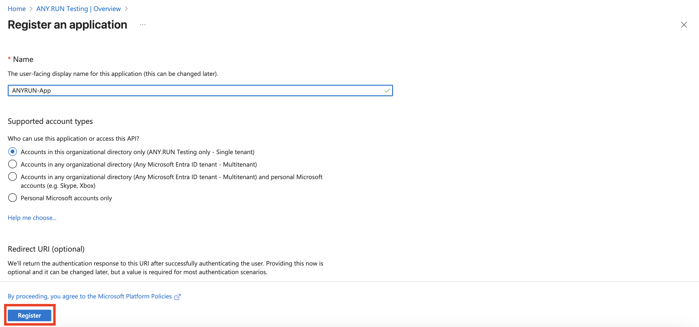
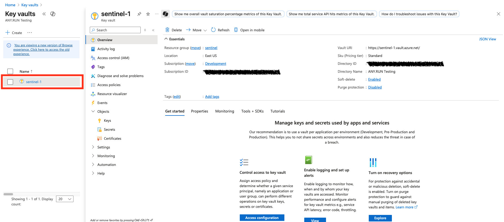
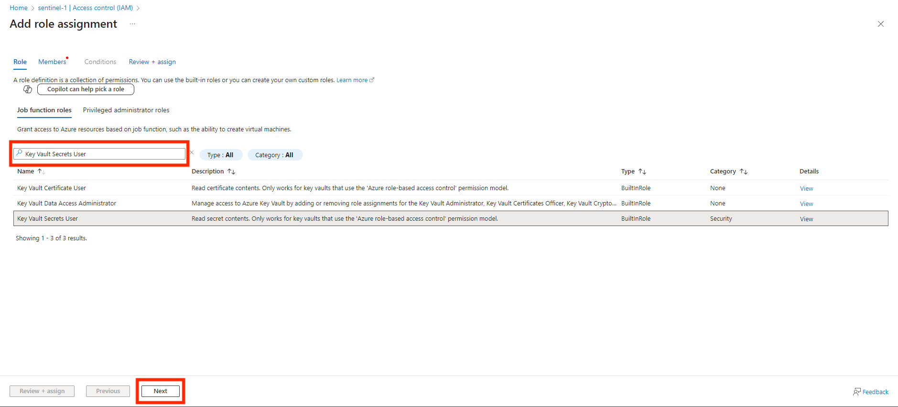
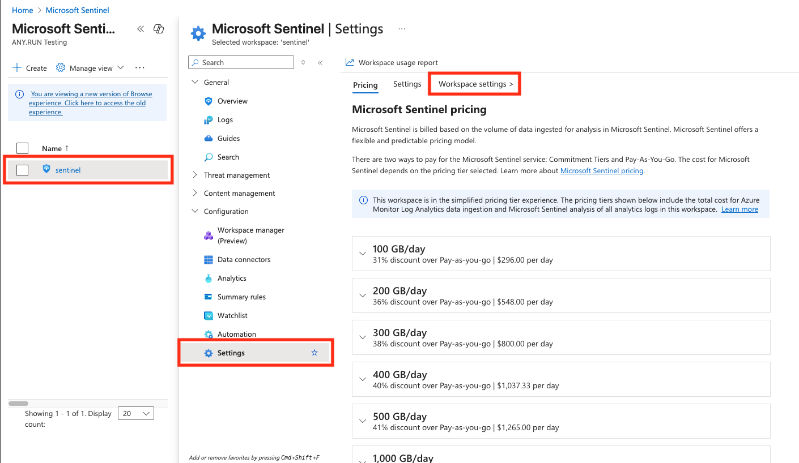
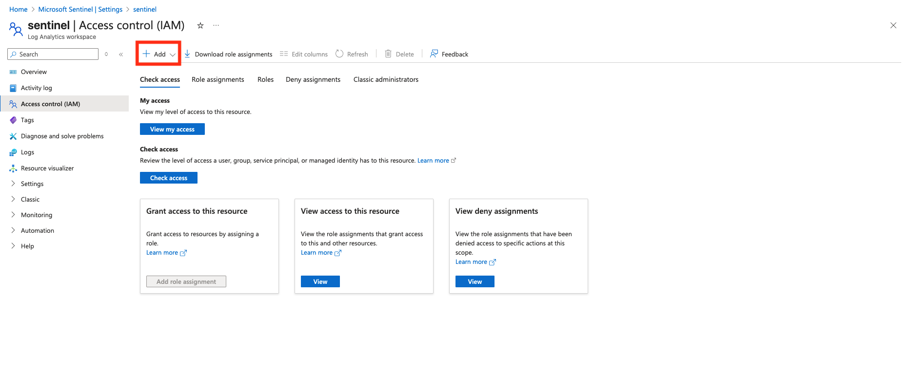
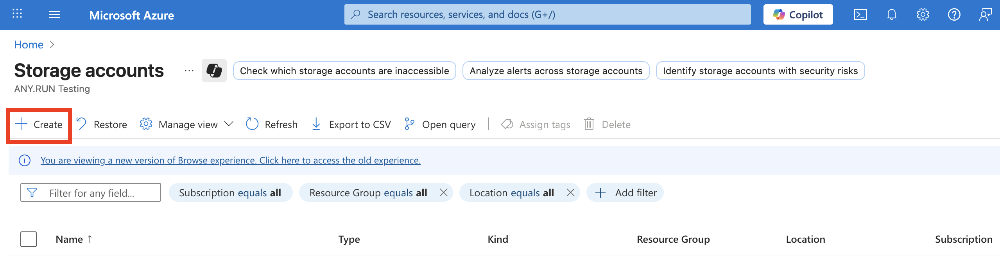
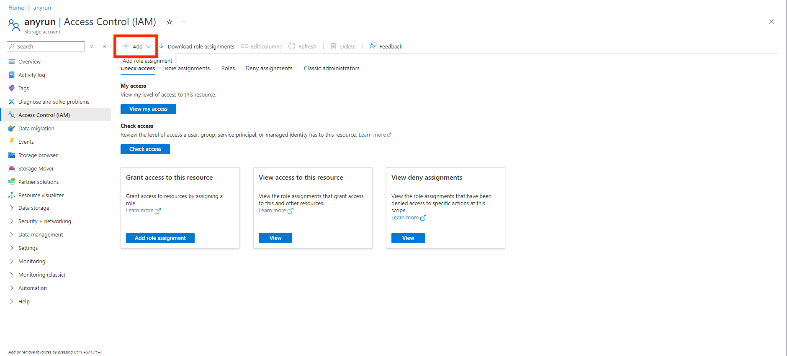

    

______________________________________________________________________

# Microsoft Sentinel Connectors for ANY.RUN Malware Sandbox

## Overview

This repository contains resources required for integrating Microsoft Sentinel with ANY.RUN Sandbox. 

The connectors enrich Microsoft Sentinel incidents by analyzing URLs or files associated with them in the sandbox. As a result, your Microsoft Sentinel incidents will include detailed info on threats. You will also be able to explore the object's behavior in a real infrastructure environment. 

Additionally, your Threat Intelligence portal in Sentinel will be enriched with Indicators of Compromise (IOCs) extracted during the sandbox analysis. You can try out the connectors for free by [getting 14-day trial](https://any.run/demo/?utm_source=anyrungithub&utm_medium=documentation&utm_campaign=sentinel&utm_content=linktodemo) of ANY.RUN Sandbox’s Enterprise plan. 

## Capabilities of connectors

- Enrichment of incidents with:
  - Analysis verdict (malicious, suspicious, unknown) 
  - Threat score (from 0 to 100) 
  - Malware tags (e.g. threat family) 
  - Table with IOC's detected during the analysis 
  - Link to the analysis session in the sandbox 
- Uploading IOC's detected during the analysis to Sentinel Threat Intelligence portal 

## Analyze URLs from Microsoft Sentinel Incidents via ANY.RUN Sandbox

**Latest Version:** 1.0.0  
**Release Date:** 10/09/2025

This playbook extracts URLs from incidents and submits it for analysis in ANY.RUN Sandbox to enrich the incident with a verdict using Azure Logic App. 

[Open connector's page](https://github.com/anyrun/anyrun-integration-microsoft/tree/main/Microsoft%20Sentinel/ANYRUN-Sandbox-URL)

## Analyze Files from Microsoft Sentinel Incidents via ANY.RUN Sandbox

**Latest Version:** 1.0.0  
**Release Date:** 10/09/2025

This playbook allows you to send files from incidents for analysis in ANY.RUN Sandbox. It uploads the file from the endpoint to Azure Blob Storage and then forwards it to ANY.RUN Sandbox using a single Azure Logic App. 

Templates are provided for endpoints running the following operating systems:
- Windows
- UNIX (Ubuntu, Debian)

[Open connector's page](https://github.com/anyrun/anyrun-integration-microsoft/tree/main/Microsoft%20Sentinel/ANYRUN-Sandbox-File)

## Analyze All Entities from Microsoft Sentinel Incidents via ANY.RUN Sandbox and Microsoft Defender for Endpoint

**Latest Version:** 1.0.0  
**Release Date:** 10/09/2025

This playbook makes the incident enrichment process in Microsoft Sentinel even more automated if you are also using Microsoft Defender for Endpoint (MDE). In this case, the entire automation mechanism can be combined into a single Azure Logic App, leveraging MDE's capabilities to extract files from endpoints via API.

[Open connector's page](https://github.com/anyrun/anyrun-integration-microsoft/tree/main/Microsoft%20Sentinel/ANYRUN-Sandbox-Defender)

## Prerequisites

### Key Vault

- You need the Enterprise pricing plan in ANY.RUN and your API key. We recommend storing your API key in Azure Key Vault. To do this, select your existing Key Vault or create a new one. Then, navigate to the **Objects** > **Secrets** section and create a new secret named `ANYRUN-APIKey`.

  > **Note:** It is recommended to keep this name unchanged. Otherwise, you will need to update it later in the deployed Logic App.

### App Registration

- You need to create a new application for your connector. To do this, go to **Microsoft Entra ID**.

- Click **Add** > **App registration**.

- Name your new application and click **Register**.

### Secret Value of created App

- To generate the Client Secret, go to your application's page and click **Generate Secret** in the **Certificates & secrets** tab.

- Specify the key name and its expiration date (optional).

- Copy and **save the Secret Value**. This value is required for deploying the connector later.

### API Permissions for new App

#### Key Vault API Permissions

- Go this tab: **Manage** > **API permissions**. Click Add a permission and choose the following options: 

- In the **Microsoft APIs** tab, add **Azure Key Vault**.

- Add the following permissions for it:

| Category | Permission Name   | Description                                                                 |
|----------|-------------------|-----------------------------------------------------------------------------|
| N/A      | user_impersonation | Allow the application full access to the Azure Key Vault service on behalf of the signed-in user |

#### Microsoft Defender ATP API Permissions

  > **Note:** This section is only required if you use Microsoft Defender for Endpoint (MDE) to extract files from the endpoint.

- Add an API connection for **WindowsDefenderATP**. Select the corresponding API in the **APIs my organization uses** tab.

- Then, select **Application permissions**.

- Select the following permissions:

| Category | Permission Name    | Description                                                                 |
|----------|--------------------|-----------------------------------------------------------------------------|
| Machine  | Machine.LiveResponse | Needed to gather evidences from machines                                  |
| Machine  | Machine.Read.All   | Needed to retrieve information about machines                               |
| Library  | Library.Manage     | Needed to upload custom ps1 script for retrieving AV related evidences      |

### Required Roles for the New App

Since the connectors use various resources available in Azure, the created application `ANYRUN-App` needs to be assigned the appropriate roles.

#### Key Vault

- Navigate to the required Key Vault where you previously added the ANY.RUN API-Key.

- Open **Access control (IAM)** > **Add** > **Add role assignment**.

- In the search window, type and select the role **Key Vault Secrets User**, then click **Next**.

- Description of the required role:

| Name                   | Description                                                                 |
|------------------------|-----------------------------------------------------------------------------|
| Key Vault Secrets User | Read secret contents. Only works for key vaults that use the 'Azure role-based access control' permission model. |

- Then, assign this role to the created application **ANYRUN-App**.

#### Sentinel

- Open your Sentinel workspace and navigate to **Settings** > **Workspace settings**.

- Open **Access control (IAM)** > **Add** > **Add role assignment**.

- In the search window, type and select the roles **Microsoft Sentinel Contributor** and **Log Analytics Contributor**, then click **Next**.

- Description of the required roles:

| Name                         | Description                                                                 |
|------------------------------|-----------------------------------------------------------------------------|
| Microsoft Sentinel Contributor | Microsoft Sentinel Contributor                                              |
| Log Analytics Contributor    | Log Analytics Contributor can read all monitoring data and edit monitoring settings. Editing monitoring settings includes adding the VM extension to VMs; reading storage account keys to be able to configure collection of logs from Azure Storage; adding solutions; and configuring Azure diagnostics on all Azure resources. |

- Then, assign these roles to the created application **ANYRUN-App**.

### Storage Account

  > **Note:** This section is only required for workflows where you use Azure Blob Storage to store files from the endpoint before submitting it to ANY.RUN Sandbox.

- Go to Azure Storage Accounts.

- Click **Create**.

- Type the name of Storage Account and click **Review + Create**.

- Open your Storage Account and go to **Access Control (IAM)** > **Add**.

- Select your app — `ANYRUN-App`.

- Find the following roles:

| Role                          | Description                                                                 |
|-------------------------------|-----------------------------------------------------------------------------|
| Storage Account Contributor   | Lets you manage storage accounts, including accessing storage account keys which provide full access to storage account data. |
| Storage Blob Data Contributor | Allows for read, write and delete access to Azure Storage blob containers and data. |

- Open your Storage Account. Go to **Data Storage** > **Containers**.

- Click **Add container**, enter its name and click **Create**.

### Deployment

- After completing the preliminary settings above, you can proceed to deploy Azure Logic Apps required for integrating Microsoft Sentinel and ANY.RUN Sandbox: 
  - [ANYRUN-Sandbox-URL](https://github.com/anyrun/anyrun-integration-microsoft/tree/main/Microsoft%20Sentinel/ANYRUN-Sandbox-URL)
  - [ANYRUN-Sandbox-File](https://github.com/anyrun/anyrun-integration-microsoft/tree/main/Microsoft%20Sentinel/ANYRUN-Sandbox-File)
  - [ANYRUN-Sandbox-Defender](https://github.com/anyrun/anyrun-integration-microsoft/tree/main/Microsoft%20Sentinel/ANYRUN-Sandbox-Defender)

## Request Support or Access to ANY.RUN’s Products

Feel free to reach out to us for help with integration, a quote, or a demo via the [contact us form](https://app.any.run/contact-us/?utm_source=anyrungithub&utm_medium=documentation&utm_campaign=sentinel&utm_content=linktocontactus).
